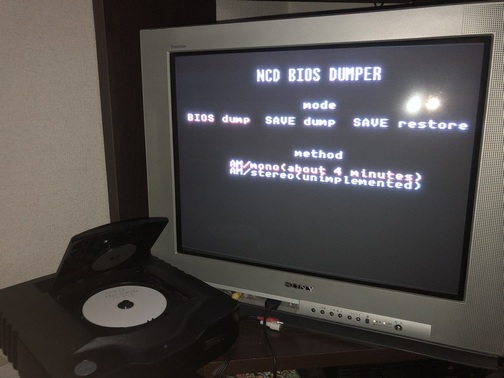
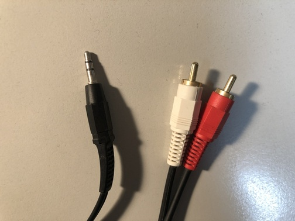
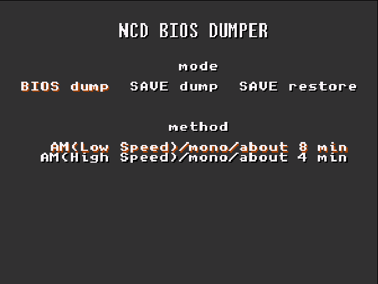
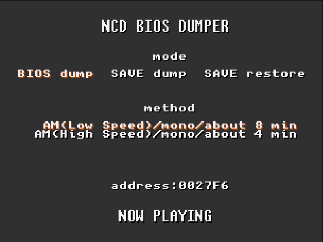
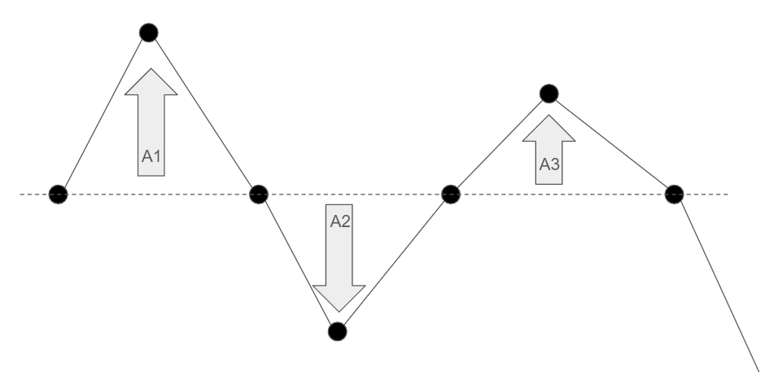

# ncd-bios-dumper
ネオジオCD上で動作するプログラムであり、BIOSを音声信号に変調して出力することをコンセプトに作成しています。
なお、現状はあくまで試作段階で精度が低いです。動けばラッキーくらいで考えてください。


## 始める前に
本当にネオジオCDのBIOSを吸い出す必要がありますか？
エミュレータなどで使用するのであれば、UNIVERSE BIOS等の互換BIOSを使用した方が圧倒的に楽です。

次に、ネオジオCD実機でのCD-R読み込みについて。
ネオジオCDでCD-R読み込みをはじくためのプロテクトがかかっているという話は聞いたことがないので、おそらくどのバージョンの本体でも読み込めると思います。（homebrewソフトについての話。一部の製品版ゲームはコピーすると実機上では動かないようにプロテクトがかけられているそうですが、今回は関係ありません。）
しかし、一般的にCD-Rの読み取りはプレスされたCDに比べて若干強いレーザー出力が必要です。へたっているドライブではCD-Rが読めないかもしれません。
**CD-Rが読み込めるネオジオCDをご準備ください**

参考:
[The NeoGeo Development Wiki Burning CDs](https://wiki.neogeodev.org/index.php?title=Burning_CDs#Reading_problems)

## 手順
1. CD-Rを焼く
最新版ReleaseのzipからCDimage/ncd_bios_dumper.isoあるいはcueからCDライティングソフトでCD-Rに焼いてください。
2. 録音環境を整える
ネオジオCDから音声を録音できるようにしてください。例えば、下記写真のようなRCA-ステレオピンプラグのケーブルを使ってPCのLine-In端子に入力します。

3. CD-RからネオジオCDを起動
下記のような画面で起動します。

左右でBIOSダンプ/SAVEダンプ（未実装）/SAVEリストア（未実装）のモードを切り替えます。
上下で出力音声の変調方式を選択しますが、現在は1方式しか対応していません。
"AM/mono"でAボタンを押すと再生が始まります。再生時間は約4分です。

4. 録音
***人間が聞く用の音にはなっていないため、スピーカーから再生されないようにご注意ください***
録音機器orソフトは下記仕様を満たせれば任意のもので構いません。参考までに、私はwin-pcでAudacityを使用して録音しました。
1度、試しに再生して8割程度(リニア)の音量になるように再生音量か録音音量を調整してください。
録音形式として下記の形式で録音してください。画面下部にFINISHEDと出たら終了です。
+ サンプリング周波数: 96kHz以上(192kHz推奨)
+ 量子化ビット数: 16bit
+ 形式: WAVE(リニアPCM)

5. デコード
最新版ReleaseのzipからDecoder/nbd_decoder.exeを用いてデコードします。
```
nbd_decoder.exe [in.wav] [out.bin]
```
出力されたbinファイルがネオジオCDのBIOSです。変調方式が良くないので、精度はよくありません。
録音から何度かやり直してみても間違っていたら間違っていたら諦めてください・・・。

デコーダーのソースは別リポジトリ（[nbd-decoder](https://github.com/scrap-a/nbd-decoder)）で公開しています。

## 開発環境
開発環境として[ngdevkit](https://github.com/dciabrin/ngdevkit)を使用しています。
また、ソースやリソースにngdevkitのサンプルコードである[ngdevkit-examples](https://github.com/dciabrin/ngdevkit-examples)を使用しています。
そのためライセンスは[ngdevkit-examples](https://github.com/dciabrin/ngdevkit-examples)(GPL3.0)に従います。
なお、使用しているngdevkitのバージョンが古い(2023年2月頃？)ため、最新のngdevkit環境ではビルドできません。そのうち更新します。

## 変調方式
一応、変調方式で分類するとすれば振幅変調(Amplitude Modulation/AM)にあたりますが、振幅変調を名乗るのはおこがましいくらいの原始的な方法で変調しています。
BIOSのデータに応じて、下記画像の各サンプル(黒丸)の振幅(A1,A2,A3)の大きさを変更しています。1つの振幅あたり2bitの情報を符号化しています。


## ToDo
+ セーブデータの入出力への対応
+ 最新の[ngdevkit](https://github.com/dciabrin/ngdevkit)環境へ移行
+ ステレオ出力への対応(高速化)
+ KCSやSCSなどの従来よく使われていた変調方式への対応(安定化)

なお、更新を保証する訳ではありません。やる気次第です。

## （参考）Neo CD SD Loaderで使用できるか？
使用できますが、[Neo CD SD Loader](http://furrtek.free.fr/sdloader/)はBIOSにパッチを当てるため、結果的に正しいBIOSは吸い出せません。
パッチ済みのBIOSは、ファームアップデート時にSDにバックアップされるため吸い出す必要もありません。
